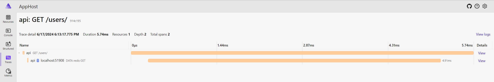

# Learning .NET Aspire by example: Social Media App using Postgres, MongoDb, Elasticsearch

The goal of this repository is to show how to build applications using .NET Aspire.

Components:

* `Aspire.Hosting.PostgreSQL` - users & followers
* `Aspire.Hosting.MongoDB` - posts
* `Aspire.Hosting.Elasticsearch` - post searching & likes analytics
* `Aspire.Hosting.Redis` - output caching
* `Aspire.Hosting.RabbitMQ` - message bus, used to denormalize data to Elastic

## Domain

For more information about implemented functionality see [REST API document](./docs/domain.md).

## Run

> 💡This project provides so called "`F5` experience", all you need to do is to clone it and run it. Migration and data seeding are performed automatically during startup as part of `MigrationService`.

```bash
 dotnet run --project ./src/AppHost/
```

Take a look at migration process:


```bash
❯ curl -X 'GET' 'http://localhost:51909/users/1' -s | jq
# {
#   "user-id": 1,
#   "name": "Jennie Klocko",
#   "email": "Jennie_Klocko@gmail.com",
#   "followers-count": 2,
#   "following-count": 2
# }
```

```bash
❯ curl -X 'GET' 'http://localhost:51909/users/1/followers' -s | jq
# [
#   {
#     "user-id": 522,
#     "name": "Jerome Kilback",
#     "email": "Jerome_Kilback12@gmail.com"
#   },
#   {
#     "user-id": 611,
#     "name": "Ernestine Schiller",
#     "email": "Ernestine_Schiller@hotmail.com"
#   }
# ]
```

```bash
❯ curl -X 'GET' 'http://localhost:51909/users/1/posts' -s | jq '.[] | {title, likes}'
# {
#   "title": "Ipsam cumque labore sapiente ea.",
#   "likes": [
#     87,
#     44,
#     15,
#   ]
# }
# {
#   "title": "Impedit commodi delectus fugit exercitationem.",
#   "likes": [
#   ]
# }
# {
#   "title": "Qui officia quos.",
#   "likes": [
#     65,
#     1
#   ]
# }
```

```bash
❯ curl -X 'POST' 'http://localhost:51909/posts/analytics/leaderboard' -s | jq
# [
#   {
#     "user-id": 98,
#     "name": "Ian Paucek",
#     "email": "Ian_Paucek@gmail.com",
#     "like-count": 202
#   },
#   {
#     "user-id": 42,
#     "name": "Neil Ryan",
#     "email": "Neil_Ryan@hotmail.com",
#     "like-count": 194
#   },
#   {
#     "user-id": 49,
#     "name": "Bruce Botsford",
#     "email": "Bruce.Botsford75@yahoo.com",
#     "like-count": 179
#   },
#   {
#     "user-id": 11,
#     "name": "Angel Gaylord",
#     "email": "Angel_Gaylord@gmail.com",
#     "like-count": 168
#   },
#   {
#     "user-id": 62,
#     "name": "Ora Smith",
#     "email": "Ora_Smith@yahoo.com",
#     "like-count": 167
#   }
# ]
```

Some of the requests are cached based on [Output caching middleware in ASP.NET Core](https://learn.microsoft.com/en-us/aspnet/core/performance/caching/output). For example:

First hit:


Subsequent hit:



## Databases

The reasoning for each type of data storage:

1. **Relational Databases (PostgreSQL):**

   **Motivation & Reasoning:** Relational databases are designed to handle structured data and relationships between data entities effectively. They are based on a relational model where data is stored in tables and the relationship between these data is also stored in tables. For a social media application, user profiles and the relationships between users (like who follows whom) are well-suited to a relational model.

   **Pros:**
   - Strong consistency and ACID (Atomicity, Consistency, Isolation, Durability) compliance which ensures reliable processing of transactions.
   - Excellent support for complex queries and joins due to SQL (Structured Query Language).
   - Mature, with plenty of tools, libraries, and resources available.

   **Cons:**
    - Can become slower as the volume of data increases.
    - Scaling horizontally (across multiple servers) can be challenging.
    - They can be overkill for simple, non-relational data.

2. **NoSQL Databases (MongoDB):**

   **Motivation & Reasoning:** NoSQL databases are designed to handle unstructured data, and they excel at dealing with large volumes of data and high write loads. They don't require a fixed schema and are easy to scale. For a social media application, posts and likes can be considered as document-like data and can be stored effectively in a NoSQL database.

   **Pros:**
   - Schema-less, which offers flexibility as data requirements evolve.
   - Generally provide easy horizontal scaling.
   - Good performance with large amounts of data.

   **Cons:**
   - Lack of standardization as compared to SQL databases.
   - Not all NoSQL databases support ACID transactions.
   - Joins and complex queries can be more difficult or not natively supported.

3. **Search and Analytics Engines (Elasticsearch):**

   **Motivation & Reasoning:** Elasticsearch is a real-time distributed search and analytics engine. It's designed for horizontal scalability, maximum reliability, and easy management. It excels at searching complex data types. For a social media application, Elasticsearch can be used to index posts and provide powerful search capabilities.

   **Pros:**
   - Excellent full-text search capabilities with a powerful query language.
   - Real-time analytics.
   - Can handle large amounts of data and scale horizontally easily.

   **Cons:**
   - Not designed to be a primary database, more suited for secondary read-heavy workloads.
   - Managing and maintaining an Elasticsearch cluster can be complex.
   - No built-in multi-document ACID transactions.

In summary, the choice of database depends on the specific needs of your application. It's common to use a combination of different types of databases (polyglot persistence) to leverage the strengths of each.
