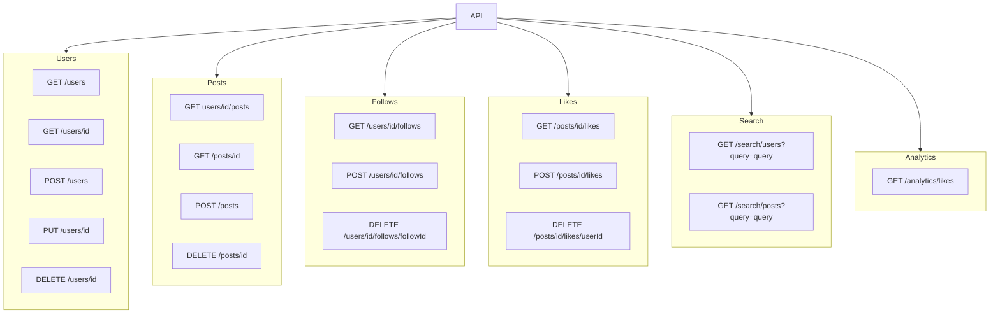

# Domain

A social media application is a platform where users can create and share content or participate in social networking. The main entities in such an application typically include:

**User**: This is an individual who uses the social media application. They have attributes such as a unique identifier (UserID), a name, an email address, etc.

**Post**: This is a piece of content created by a user. It has attributes such as a unique identifier (PostID), a title, a body, and a reference to the user who created it (Author).

**Follow**: This represents the action of one user (the follower) choosing to see the posts of another user (the followed) in their feed. It is a relationship between two users.

**Like**: This represents the action of a user showing appreciation for a post. It is a relationship between a user and a post.

## REST API

RESTful API specification:

1. **Users**
   - **GET /users:** Returns a list of all users.
   - **GET /users/{id}:** Returns the user with the specified ID.
   - **POST /users:** Creates a new user. Expects a JSON body with the user details.
   - **PUT /users/{id}:** Updates the user with the specified ID. Expects a JSON body with the new user details.
   - **DELETE /users/{id}:** Deletes the user with the specified ID.
2. **Posts**
   - **GET users/{id}/posts:** Returns a list of all posts.
   - **GET /posts/{id}:** Returns the post with the specified ID.
   - **POST /posts:** Creates a new post. Expects a JSON body with the post details.
   - **DELETE /posts/{id}:** Deletes the post with the specified ID.
3. **Follows**
    - **GET /users/{id}/follows:** Returns a list of all users that the user with the specified ID is following.
    - **PUT /users/{id}/follows/{followId}:** Makes the user with the specified ID follow another user. Expects a JSON body with the ID of the user to follow.
    - **DELETE /users/{id}/follows/{followId}:** Makes the user with the specified ID unfollow the user with the specified followId.
4. **Likes**
   - **GET /posts/{id}/likes:** Returns a list of all users who have liked the post with the specified ID.
   - **POST /posts/{id}/likes:** Makes a user like the post with the specified ID. Expects a JSON body with the ID of the user.
   - **DELETE /posts/{id}/likes/{userId}:** Removes the like from the user with the specified userId on the post with the specified ID.
5. **Search**
   - **GET /search/users?query={query}:** Searches for users based on the query string.
   - **GET /search/posts?query={query}:** Searches for posts based on the query string.
6. **Analytics**
   - **GET /analytics/likes:** Returns analytics data about likes, such as the total number of likes, the average number of likes per post, etc.

This API allows for full CRUD operations on users and posts, as well as following/unfollowing users and liking/unliking posts. It also provides search functionality for users and posts, and analytics data about users and posts.

